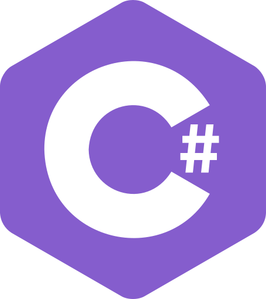

## Hi there 👋 I'm Angiy

## I'm studying the following areas:
  <h2 style="color:#E34F26">HTML 5</h2>
  <h2 style="color:#1572B6">CSS 3</h2>
  <h2 style="color:#3776AB">PYTHON</h2>
  <h2 style="color:#855DCD">C#</h2>
  <h2 style="color:#1384C8">ASP.NET CORE</h2>